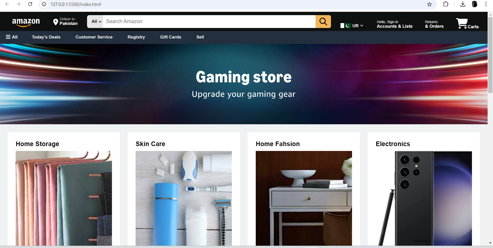
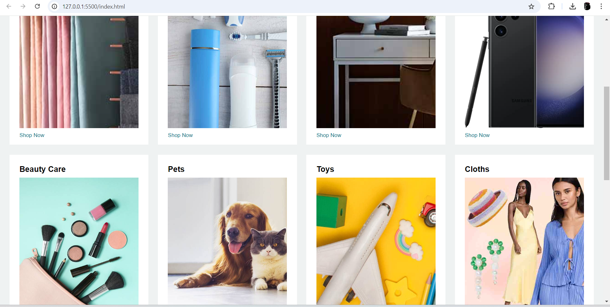
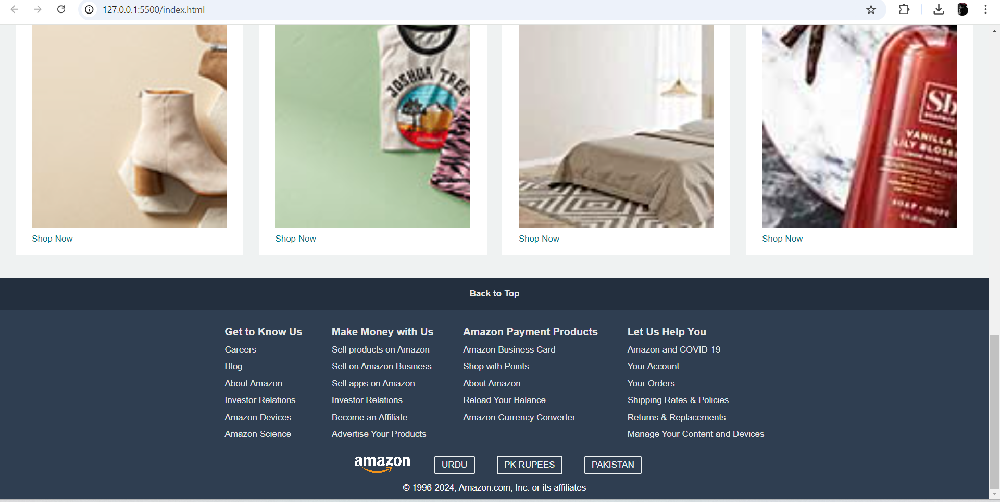

# Amazon Clone Homepage

This project is a simple Amazon-clone homepage built using HTML and CSS. It mimics the basic layout of Amazon's website.

## How to Use

### 1. Download the Folder

- Click on the green "Code" button at the top right of this repository.
- Select "Download ZIP" and extract the folder to your desired location.

### 2. Open in VS Code or Any Code Editor

- Open Visual Studio Code or your preferred code editor.
- Use the "Open Folder" option to load the project folder you downloaded.

### 3. Open in Browser

- Navigate to the folder and double-click the `index.html` file to open it in your web browser.

## Project Structure

- **`index.html`**: Contains the HTML code that structures the page.
- **`style.css`**: Contains the CSS that styles the page.
- **`img/`**: Folder containing the images used in the homepage design.

## Preview

Here are some screenshots of the Amazon Clone Homepage:

---

---

---
Enjoy exploring the project!
